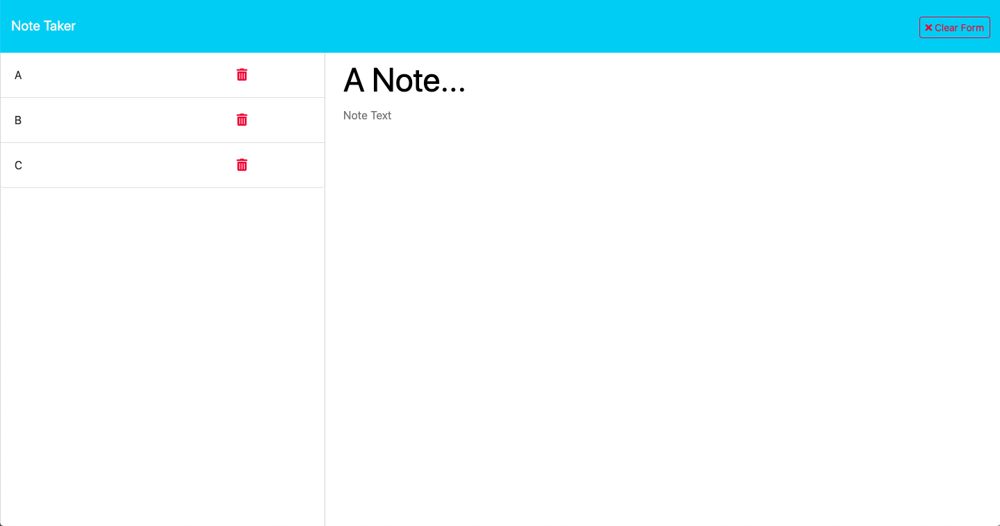

# Note Taker App

## Description
This is an app that writes, reads, and deletes notes.  It was coded using express.js and was deployed with Heroku.

## Link
Link to Heroku deployment: [LINK](https://noter-apper-500f3ff9c320.herokuapp.com/)

## Screenshot

## Credits
Link to starter code: [LINK](https://github.com/coding-boot-camp/miniature-eureka)